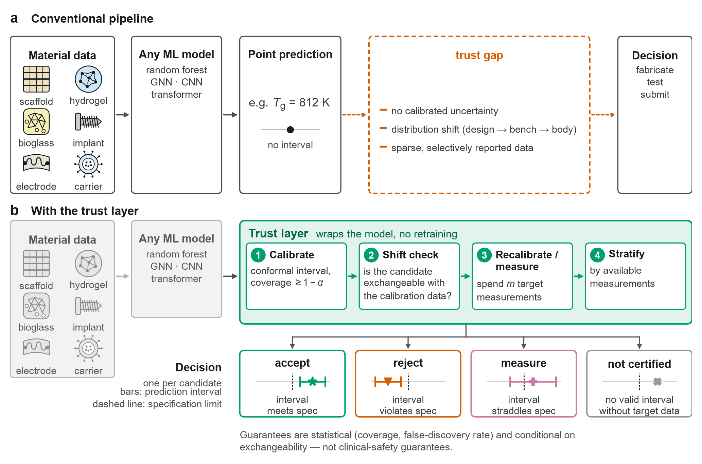
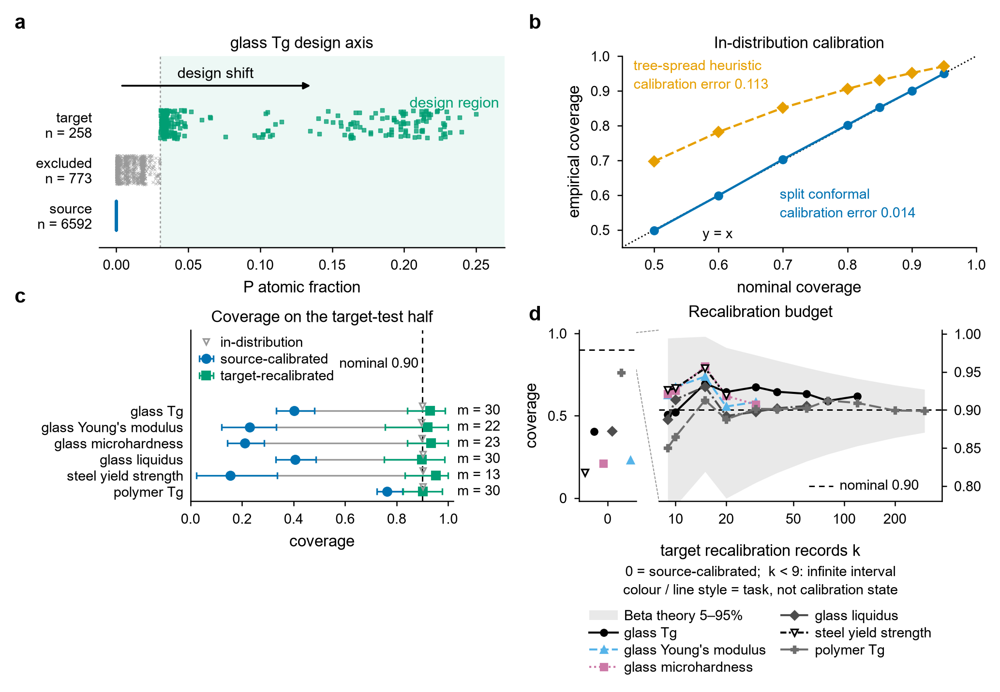
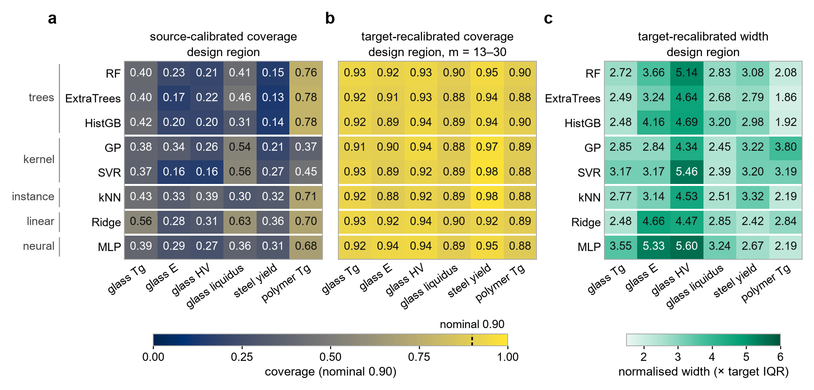
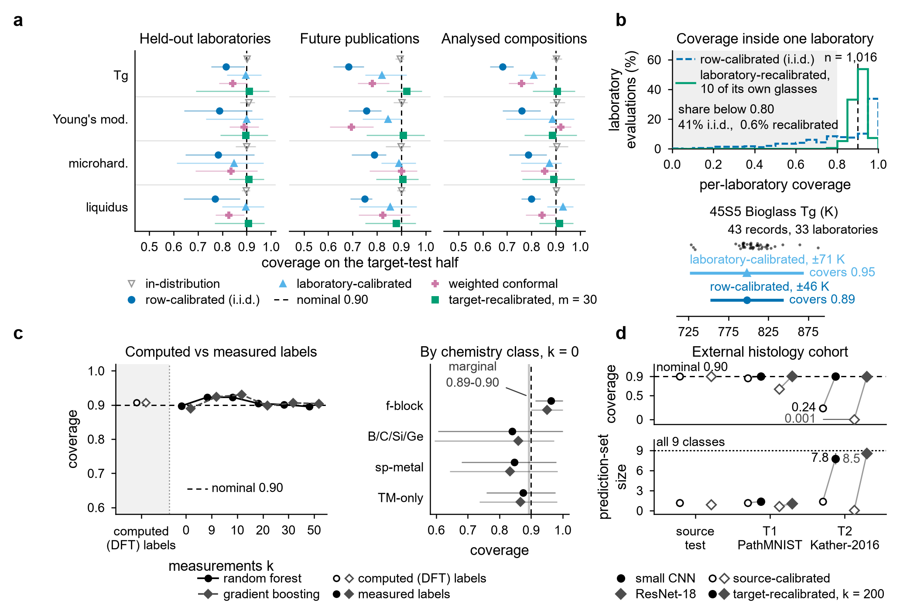
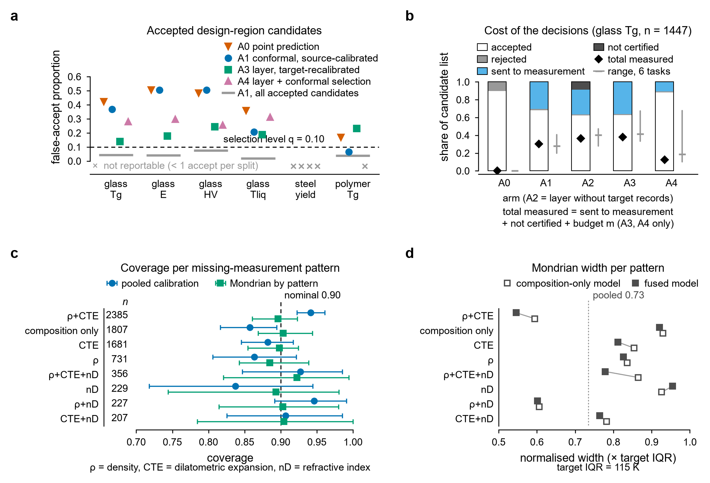
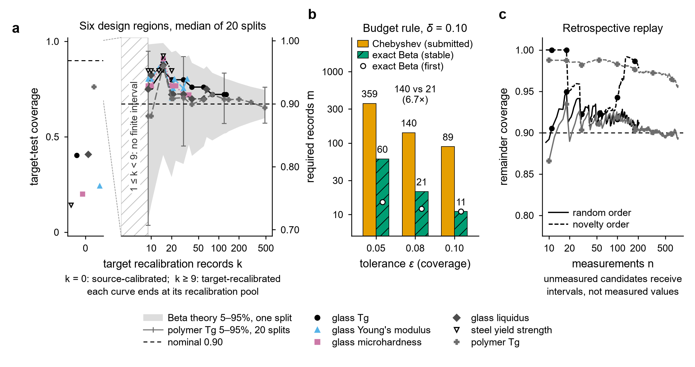
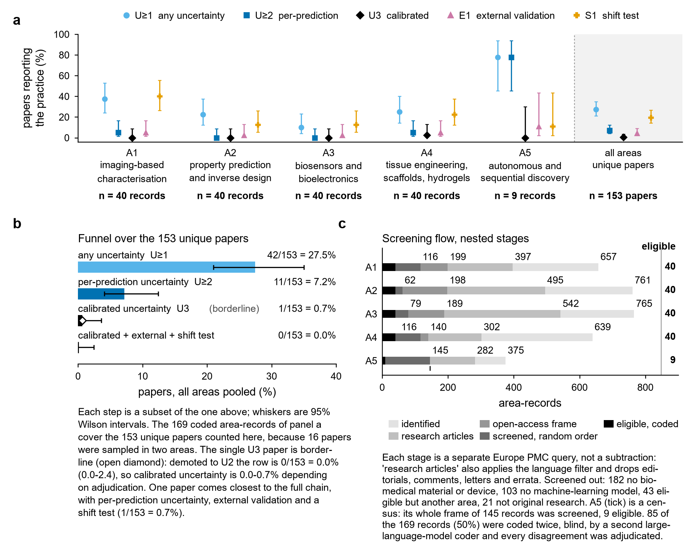

# Trustworthy AI for biomedical materials: a model-agnostic trust layer

Code, processed data, split indices and results for the BMEMat Perspective
*"Trustworthy AI for Biomedical Materials: A Model-Agnostic Trust Layer for
Calibrated Uncertainty under Distribution Shift"*.

Everything in the paper is produced by these scripts from open data. No number
in the manuscript is typed by hand: tables are generated from the result JSONs
and figures are drawn from the same files.

## What this is about

Machine-learning models for biomedical materials (bioactive glasses, scaffolds,
implant alloys, bioelectronic composites) almost always report a point prediction.
A designer who uses such a model to decide what to make next is asking for more: how
far can this number be trusted, and is the candidate even inside the region the model
has seen? This repository implements and tests a **trust layer**: a wrapper that turns
*any* trained predictor into a calibrated, auditable decision procedure, without
retraining it.



**Figure 1.** (a) A conventional pipeline goes from material data to a point prediction to a
decision; between the two sits the trust gap. (b) The trust layer wraps the same model with
four steps and returns one of four decisions per candidate: accept, reject, measure or not
certified.

The four steps (`code/trustlayer.py`, one class, `TrustLayer`):

| Step | Method | What it guarantees |
|---|---|---|
| 1 Calibrate | split conformal prediction | marginal coverage >= 1 - alpha for candidates exchangeable with the calibration data |
| 2 Shift check | conformal novelty p-values | a bounded false-flag rate on exchangeable candidates (no power guarantee) |
| 3 Recalibrate or refuse | target-domain calibration with a stated budget of measurements | coverage restored in the target stratum; otherwise the candidate is *not certified* |
| 4 Stratify | Mondrian conformal by the measurements actually available | pattern-specific coverage when characterisation is incomplete |

Optional: conformal selection bounds the false-discovery rate among *accepted* candidates.
**None of these is a clinical-safety guarantee**; they are statistical statements that hold
under exchangeability (see Section 4.5 of the paper).

## Quick start (no data download, about 5 seconds)

```bash
conda env create -f environment.yml && conda activate trustlayer-biomat
python examples/quickstart.py
```

```python
from trustlayer import TrustLayer
layer = TrustLayer(RandomForestRegressor(300), alpha=0.10)   # any fit/predict model
layer.fit(X_train, y_train)
layer.calibrate(X_cal, y_cal)                  # source-domain calibration records
layer.shift_check(X_new)                       # (p-values, flags): is X_new like the calibration data?
layer.recalibrate(X_target_few, y_target_few)  # a budget of m target-domain measurements
lo, hi = layer.interval(X_new)                 # calibrated 90 % interval (inf = not certified)
layer.decide(X_new, tau=6.0, direction="ge")   # accept / reject / measure / not_certified
```

Output of the example, on synthetic data where the model is trained on one region and asked
about another:

```
nominal coverage                                 0.90
conventional region, source-calibrated           0.91
design region,       source-calibrated           0.00   <- silent failure
shift check flags 2% of conventional and 100% of design candidates
design region, with shift check, no target data  not certified for 100% of candidates
design region, recalibrated on m = 30 records    0.89
decisions for design candidates: {'accept': 32, 'measure': 368}
```

## Main findings

All numbers are means over 20 resampling splits (mean and 2.5-97.5 percentile range in the
result JSONs). Coverage is nominally 0.90.

**1. Models are over-confident exactly where designers want to go.**
On 7,623 bioactive-system glasses, split conformal prediction is calibrated in distribution
(coverage 0.90, calibration error 0.014). In the high-phosphorus design region the same
intervals cover only 0.40. Across six composition-to-property tasks, source-calibrated
coverage falls to 0.15-0.76; recalibrating on 13-30 target records restores 0.90-0.95, at
intervals 2.1-5.1 times wider than the target interquartile range.



**Figure 4.** (a) The phosphorus design axis. (b) In-distribution calibration. (c) Coverage in
the design region before (blue) and after (green) recalibration. (d) Coverage against the
number of target records k; no finite interval exists below k = 9 at alpha = 0.10.

**2. The failure is not specific to one model.**
Eight model families (tree ensembles, kernel methods, k-NN, ridge, a neural network) times six
tasks: coverage falls below 0.80 in 48 of 48 combinations and recalibration restores at least
0.85 in 48 of 48.



**3. Genuine shifts differ in kind from constructed ones.**
Held-out laboratories and later publication years give moderate under-coverage (0.68-0.82);
computed-versus-measured formation enthalpies stay calibrated; on an externally acquired
histology cohort the classifiers fail outright (coverage 0.24 and 0.001), and recalibration
restores validity only by returning near-complete prediction sets, that is, by refusing to
decide.



**4. Coverage is not a decision guarantee.**
Source-calibrated intervals held a pooled false-accept rate of 0.02-0.07, yet 20-51 % of the
design-region candidates they accepted were out of specification. Most of the improvement comes
from the shift check and abstention, not from recalibration.



**5. Recalibration has a knowable cost.**
Coverage after k exchangeable records follows a Beta distribution, which gives an exact budget
rule (about 6-8 times less demanding than the Chebyshev rule we first proposed).



**6. What the literature reports.**
A reproducible scoping survey of 153 open-access studies finds that 27.5 % report any
uncertainty, 7.2 % report per-prediction uncertainty, and one assesses its calibration.
The coding was done by large language models under a frozen protocol; the agreement statistics
bound the consistency of that procedure, not its accuracy against human coders.



## Layout

| Path | Contents |
|---|---|
| `examples/quickstart.py` | the trust layer on synthetic data, runs in seconds |
| `code/trustlayer.py` | the trust layer as one decision procedure (`TrustLayer`) |
| `code/common.py` | datasets, shift definitions, the split protocol, conformal procedures, metrics, models |
| `code/PROTOCOL.md` | the binding protocol every analysis follows |
| `code/exp_*.py` | one script per analysis (see the table below) |
| `figures/` | `style.py` (journal style) and one script per figure |
| `docs/figures/` | PNG previews of the paper's figures shown in this README |
| `results/` | result JSONs, per-analysis reports (`*.md`) and `results/splits.zip` with every split's index sets |
| `data/` | `get_data.py`, which downloads or rebuilds every dataset |
| `survey/` | the systematic-survey protocol, queries, screening and coding code, and the coded-paper table |

## Analyses

| Script | Section of the paper |
|---|---|
| `exp_R1_core.py` | 5.2 calibration and design-region shift (six tasks, random forest) |
| `exp_R2_models.py` | 5.4 model-agnosticism (eight model families) |
| `exp_R3_uq.py` | 5.5 uncertainty scorecard (seven uncertainty methods, full metric set) |
| `exp_R4_realshift.py` | 5.3 genuine shifts: held-out laboratories, publication years, measurement protocol |
| `exp_R4b_dft_expt.py` | 5.3 computed versus measured formation enthalpy |
| `exp_R5_imaging.py` | 5.3 histology with an external cohort |
| `exp_R6_fusion.py` | 5.7 naturally incomplete characterisation measurements |
| `exp_R7_pipeline.py` | 5.6 the layer as one decision procedure |
| `exp_R8_budget.py` | 5.8 recalibration budget and retrospective replay |
| `exp_R9_*.py` | 5.9 risk control, weighted conformal, local coverage, ESOL |

## Reproducing the paper

```bash
conda env create -f environment.yml && conda activate trustlayer-biomat
python data/get_data.py            # downloads or rebuilds every dataset (see below)
cd code && python exp_R1_core.py   # ~10 min on 6 cores; every other exp_*.py is run the same way
cd ../figures && python fig4_design_shift.py
```

Each script writes `results/<tag>.json` (all numbers) and `results/<tag>.md` (a
readable report). Runtimes on a 28-core workstation with one RTX 4000 Ada GPU
are given at the end of each report.

## Data sources

All data are open. `data/get_data.py` fetches or rebuilds them and records the versions:

| Data | Source | How it is obtained |
|---|---|---|
| Glass properties (bioactive-system subset) | SciGlass, through `glasspy` | downloaded |
| Steel yield strength, formation enthalpy, glass-forming ability | `matminer` datasets | downloaded; Magpie descriptors recomputed |
| Aqueous solubility | ESOL/Delaney, MoleculeNet | downloaded |
| Polymer glass-transition temperature | `OsBaran/polymer_tg_dataset` on HuggingFace | downloaded; ten RDKit descriptors recomputed |
| Histology | PathMNIST (MedMNIST v2) and Kather et al. 2016 (Zenodo 10.5281/zenodo.53169) | downloaded |

**A caveat on the polymer set.** It is a community upload whose original experimental source
we could not establish, so we use it only as a descriptor-level benchmark, not as curated
polymer data. The descriptors are recomputed from the SMILES; 7,795 of 7,808 rows are
identical to the ones used in the paper and 13 differ in the heavy-atom count of a few
unusual repeat units. Each dataset keeps the licence of its source; see `LICENSE-note.md`.

## Conventions that matter

* Splits are grouped: replicate records of one composition never straddle a split.
* Target-region records are halved into a recalibration pool and a target-test set;
  nothing that touches target-test labels is used for calibration, budgets or thresholds.
* The conformal quantile is the finite-sample one and is `+inf` when the calibration
  set is too small (fewer than 9 records at alpha = 0.10).
* Results are reported as the mean over 20 splits with the 2.5-97.5 percentile range;
  the splits resample one dataset, so this is split-to-split variability, not a
  population confidence interval.

## Limitations

The design-region shifts are controlled proxies and the genuine shifts are still not
in-vitro-to-in-vivo shifts: no wet-lab or animal measurement was made. The guarantees are
marginal, not conditional on a candidate or a region. Recalibration needs labelled
target-domain data, which is the scarcest kind in translation. The acquisition analysis is a
retrospective replay, not a prospective closed-loop campaign. The full list is in Section 7
of the paper.

## Citation

Zhang W, Lai M, Zhu J, Jiao S, Jiang W, Tao Z, Wen X. *Trustworthy AI for Biomedical
Materials: A Model-Agnostic Trust Layer for Calibrated Uncertainty under Distribution
Shift.* BMEMat (under revision).
